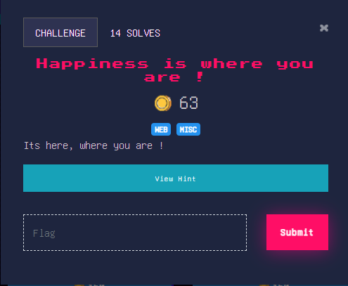
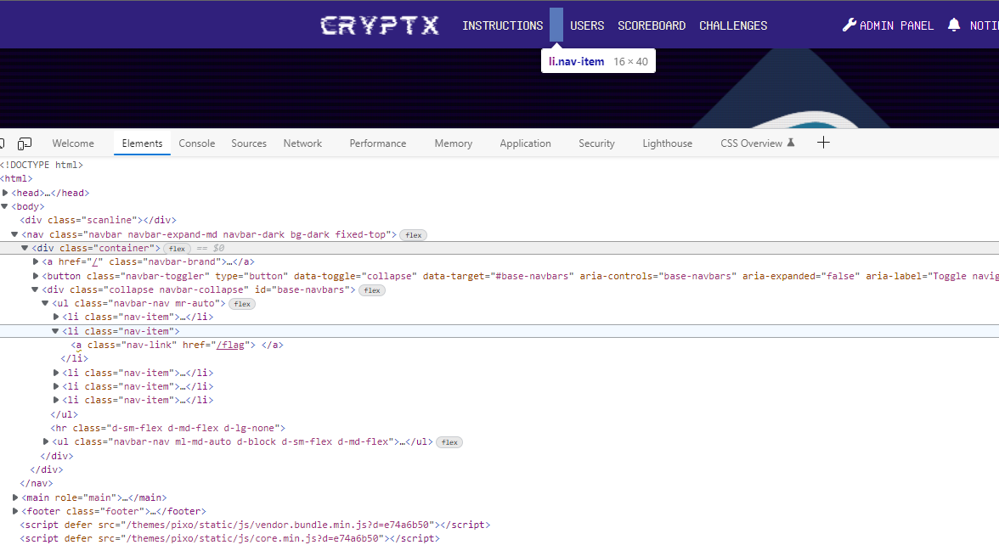
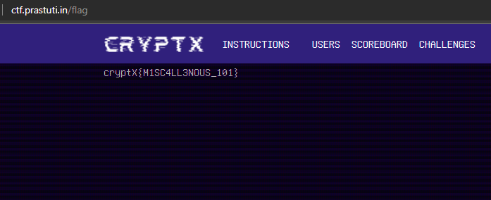

## Easy

>Hint : Check in the main ctf page

### Solution
Hint suggests checking the main CTF page \
Inspecting the site we find a hidden button in the Navigation bar pointing to page `./flag`

Going there we get our flag

flag : **cryptX\{M1SC4LL3NOUS_101}**