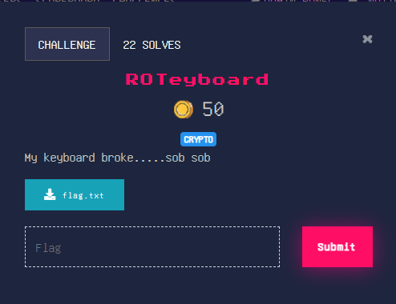

## Easy

### Solution
The flag.txt contains `nuoqiBW7H7Q0@I1@GPUM4M6E` \
Its a Keyboard Shift Cipher and passing it to [Dcode.fr](https://www.dcode.fr/keyboard-shift-cipher) gives us

`cryptX{4D4P7T0SURV1V3}`

flag : **cryptX\{4D4P7_T0_SURV1V3}**