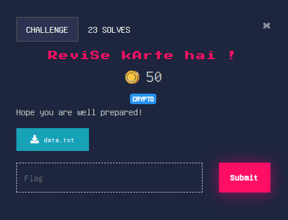

## Easy

<p align="center"></p>


### Solution
From the heading we know its an RSA challenge
data.txt contains 
```
e: 1
c: 44981230718202721537577216820443782300191062024837708920534183260861044644221
n: 5975837000304882429200890192821062116133229409734067863078801260868081658826316704230808924297304531899706067941390404882070090709916066702180974969498031
```

Notice that **e** is chosen very small
We can perform Low Public Exponent attack
> If the public exponent is small and the plaintext **m** is very short, then the RSA function may be easy to invert, which makes certain attacks possible.

We know that    \
For e=1 `ct = m mod n`
or m = n x i + ct where i = {1,2,3....} 

For i =0 we get ,
```python
>>> m= 44981230718202721537577216820443782300191062024837708920534183260861044644221
>>> bytes.fromhex(hex(m)[2:])
b'cryptX{10Ok$_11Ke_YoU_ARe_rEAdY}'
```


flag : **cryptX\{10Ok$_11Ke_YoU_ARe_rEAdY}**