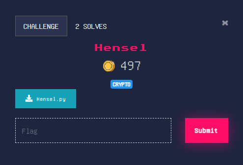

## Hard

<p align="center"></p>

### Solution

Use [Hensel's lifting lemma](https://en.wikipedia.org/wiki/Hensel%27s_lemma) to find roots of the polynomial

f(x) = (x^2 - a*x + b) - rem (mod N) 

where N = p^k, p = 3, k = 234

After finding such 'x' we can XOR it with the ciphertext to get back our plaintext.

Solve Script: [solver.sage](solver.sage)


flag : **cryptX\{A7_7H3_S7R0K3_0F_M1DN16HT}**

### Alternate Solution

```python

a = 33082998332584638566587125764184420867617324148502431151813822348987775700127775823856251326490503047658083961022734
b = 38848025438405538237400915804996834418366331251707458369278063801247549776508137044348997971448661015434158869739125
rem = 16529556519943321362765374537857289447769907287823881733923991961547660872571319581737521354764925213188468331136984
ct = 2061913358303018005877994008502334458814131193142666966850360999256879910858083771920447469745590604098002944308216


p = set([0])

for i in range(1, 244):
    _n = pow(3, i)
    temp = set()
    for x in p:
        if ((pow(x, 2, _n) - a * x + b - rem) % _n) == 0:
            temp.add(x)
        x += _n // 3
        if ((pow(x, 2, _n) - a * x + b - rem) % _n) == 0:
            temp.add(x)
        x += _n // 3
        if ((pow(x, 2, _n) - a * x + b - rem) % _n) == 0:
            temp.add(x)
    p = temp

from gmpy2 import is_prime

for a in p:
    if is_prime(a):
        print((a ^ ct).to_bytes(40, "big"))
```