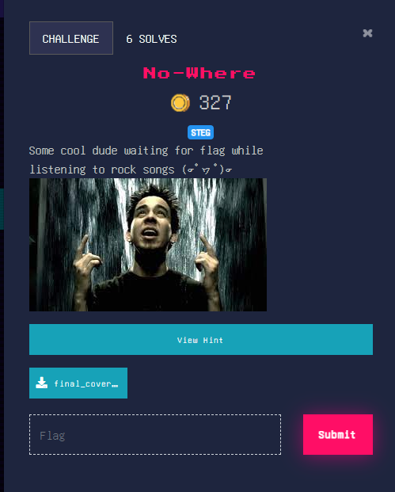

## Hard

<p align="center"></p>

### Solution

In this challenge we are provided with `final_cover.jpg` \
Upon closer inspection with binwalk we find that a RAR archive is hidden inside it. \
Extracting that we get a note and an audio file which hints at LSB steganography inside audio.
```sh
$ binwalk -D='.*' final_cover.jpg

DECIMAL       HEXADECIMAL     DESCRIPTION
--------------------------------------------------------------------------------
0             0x0             JPEG image data, JFIF standard 1.01
8644          0x21C4          RAR archive data, version 4.x, first volume type: MAIN_HEAD

$ cd _final_cover.jpg.extracted

$ file *
0:    JPEG image data, JFIF standard 1.01, aspect ratio, density 1x1, segment length 16, baseline, precision 8, 300x168, components 3
21C4: RAR archive data, v4, os: Win32

$ unrar x 21C4 

UNRAR 6.11 freeware      Copyright (c) 1993-2022 Alexander Roshal


Extracting from 21C4

Extracting  help.txt                                                  OK 
Extracting  hidden.wav                                                OK 
All OK
```

Using the hints from the help.txt we guess that only 1 bit is used for hiding the message \
Using **stegolsb** we can extract the hidden text 


```sh
$ stegolsb wavsteg -r -i hidden.wav -o out.txt -n 1 -b 1000

$ cat out.txt
cryptX{TU_Ch1z_&@D1_haI_ms7_mSt}
```

flag : **cryptX\{TU_Ch1z_&@D1_haI_ms7_mSt}**