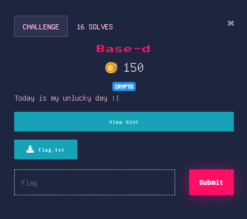

## Medium

<p align="center"></p>

> Hint : base 2 base 4 base 10 base ?

### Solution

flag.txt contains `333ac9089a5c0960819107866376c15ba44b5ba885a6c49c581b0227703a69b04b716b0a50491b` \
which can be initially mistaken for a hex-encoded string but it isnt
```python
>>> bytes.fromhex('333ac9089a5c0960819107866376c15ba44b5ba885a6c49c581b0227703a69b04b716b0a50491b')
b"3:\xc9\x08\x9a\\\t`\x81\x91\x07\x86cv\xc1[\xa4K[\xa8\x85\xa6\xc4\x9cX\x1b\x02'p:i\xb0Kqk\nPI\x1b"
```

The challenge name base-**d** suggests base -13 as **d** in hex systems stands for 13 \
Also in Christianity 13 is usually regarded as the 'unlucky' number 

```python

mp =dict()
mp[10]='a'  #map 10 as 'a'
mp[11]='b'  #map 11 as 'b'
mp[12]='c'  #map 12 as 'c'

def b10_from_b13(t:str):
    val=0
    t=t[::-1]
    for i,v in enumerate(t):
        rem =t[i]
        if rem in mp.values():
            for x,y in mp.items():
                if rem ==y:
                    rem =x
                #print(f"found key {rem}")
        else:
            rem =eval(rem)
        val+=rem*13**i
            
    return val
```
```py
>>> bytes.fromhex(hex(b10_from_b13('333ac9089a5c0960819107866376c15ba44b5ba885a6c49c581b0227703a69b04b716b0a50491b'))[2:])
b'cryptX{H!nT$_4R3_imPoRTAN7_YoU_kNoW}'
```

### Alternative

Python actually has inbuilt base conversions
```py
>>> int('333ac9089a5c0960819107866376c15ba44b5ba885a6c49c581b0227703a69b04b716b0a50491b',13)
>>> bytes.fromhex(hex(_)[2:])
b'cryptX{H!nT$_4R3_imPoRTAN7_YoU_kNoW}'
```


flag : **cryptX\{H!nT$_4R3_imPoRTAN7_YoU_kNoW}**