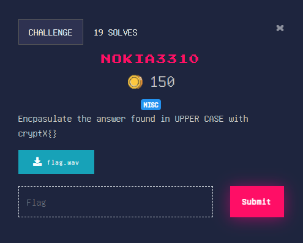

## Medium

### Solution

We are given an audio file which upon playing makes some regular keypad sounds \
From the title of challenge the sounds makes sense

This turns out to be Dual Tone Multi Frequency (DTMF) signals \
Passing the audio to https://unframework.github.io/dtmf-detect/ we get\
`38633386666633777727773333388661`

Pass this to an online Multi-tap Phone SMS decoder like https://www.dcode.fr/multitap-abc-cipher \
We get **DTMFTONESARFEUN**

flag : **cryptX\{DTMFTONESAREFUN}**