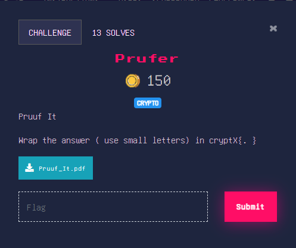

## Medium

### Solution

Google Prufer Sequences to know more.It goes like this 
>Choose a leaf (a vertex of degree 1) with the smallest label and write down the label of its only neighbor. Then eliminate the leaf from the tree and repeat the process. This sequence of labels forms the Prüfer coding of the tree

You can also go through this video [Prufer Sequences - Encoding](https://www.youtube.com/watch?v=Caqn-Vx4PoY)

For the first tree graph you will get the sequence `[1,2,1,2,1]` \
Adding the elements gets you 7 which corresponds to **g** in English Alphabets

Similarly for all other 8 trees you get **r,e,a,t,f,l,a,g**

flag : **cryptX\{greatflag}**