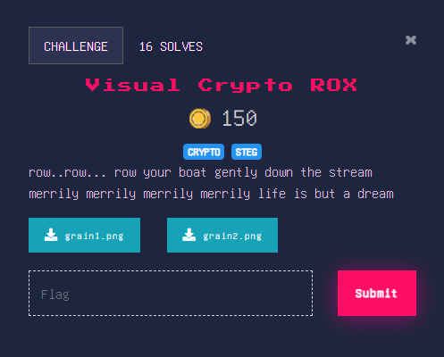
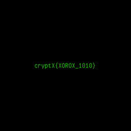

## Medium

<p align="center"></p>

### Solution

We are given two images `grain1.png` & `grain2.png` \
Nothing of value is found while using binwalk or stegsolve or strings
Xor'ng both of them together produces another image 

**SCRIPT**
```python
from PIL import Image

# open both photos
i1 = Image.open('test.png')
i2 = Image.open('scrambled2.png')

# get width and height
width1, height1 = i1.size

# open new image
i3 = Image.new('RGB', (width1, height1))

# load the pixels
pixels = i3.load()

# loop through all pixels
for i in range(width1):
    for j in range(height1):
        # xor the values
        x = i1.getpixel((i,j))[0] ^ i2.getpixel((i,j))[0]
        y = i1.getpixel((i,j))[1] ^ i2.getpixel((i,j))[1]
        z = i1.getpixel((i,j))[2] ^ i2.getpixel((i,j))[2]

        # if all white then convert to black
        if (x,y,z) == (255,255,255):
            (x,y,z) = (0,0,0)

        # put the new pixels in place
        i3.putpixel((i,j), (x,y,z))

# save the image
i3.save("flag.png", "PNG")
```

Alternatively if you are a linux user you can use StegSolve

<p align="center"></p>

flag : **cryptX\{X0R0X_1010}**